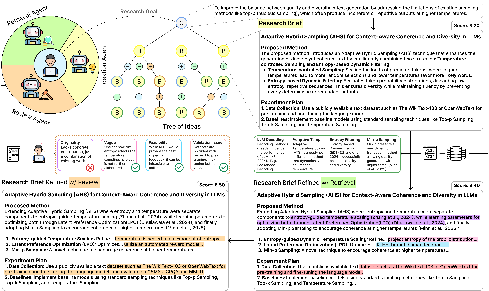
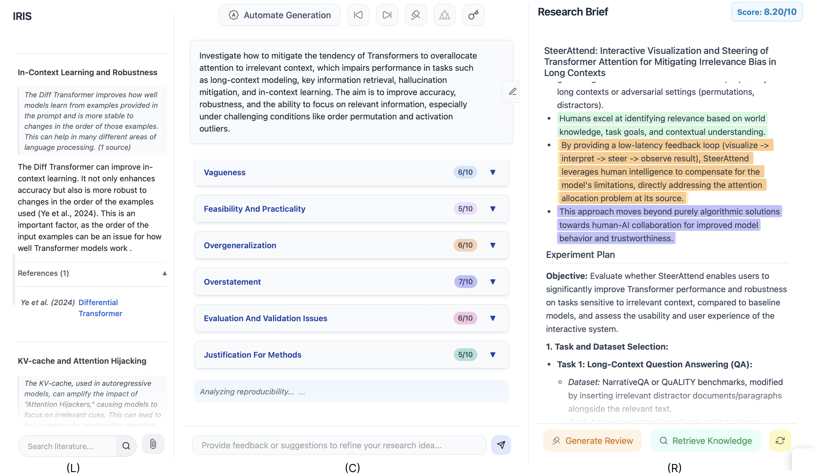

# IRIS - Interactive Research Ideation System



## 🔗 Setup

This project uses ```uv``` for package management, but you can use any virtual environment.

1.  **Clone the repository:**
    ```bash
    git clone https://github.com/Anikethh/IRIS-Interactive-Research-Ideation-System.git
    cd IRIS-Interactive-Research-Ideation-System
    ```

2.  **Activate virtual environment:**
    ```bash
    # Sync environment
    uv sync

    # Activate
    source .venv/bin/activate 
    ```

3.  **Set Environment Variables:**
    Setup your API keys:
    ```bash
    export S2_API_KEY="your_semantic_scholar_api_key" 
    export GEMINI_API_KEY="your_google_gemini_api_key" 
    ```

## 🖥️ Running the Application

Ensure your virtual environment is activated, then run:

```bash
python app.py
```



## 📋 Requirements

- Semantic Scholar API Key
-  LLM API Key for any provider supported by LiteLLM

## 📧 Cite
